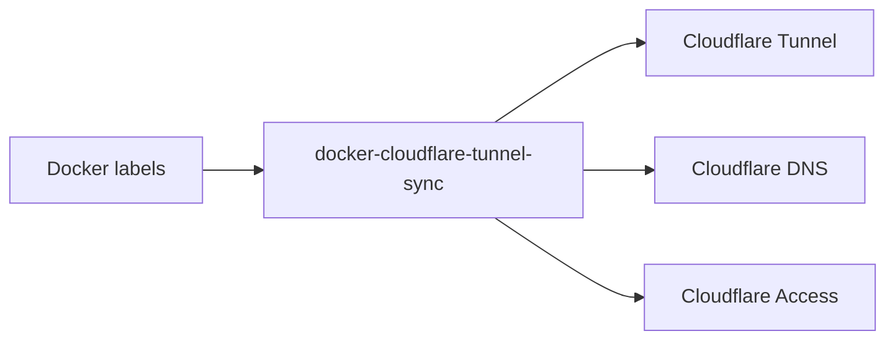

# docker-cloudflare-tunnel-sync

[](https://github.com/Darkdragon14/docker-cloudflare-tunnel-sync/releases/latest) [](https://github.com/Darkdragon14/docker-cloudflare-tunnel-sync/actions/workflows/tests.yml) [](https://github.com/Darkdragon14/docker-cloudflare-tunnel-sync/actions/workflows/ghcr.yml)

> Turn Docker labels into Cloudflare Tunnel routes, DNS records, and Access rules.

Stop managing Cloudflare dashboards by hand.  
Let your containers be the source of truth.

> **Disclaimer:** Use a dedicated Cloudflare Tunnel for this controller. If you attach it to an existing tunnel that already has published application routes, enabling managed sync can delete those routes.

---

## ✨ Why this exists

Managing Cloudflare Tunnel routes manually does not scale.

- Routes drift over time
- Old services stay exposed
- Access rules become outdated
- Documentation gets ignored

This project solves that by syncing Cloudflare configuration directly from Docker container labels.

If a container exists → it is exposed.  
If it disappears → Cloudflare is cleaned up.

No manual work. No drift.

---

## 🚀 What it does

`docker-cloudflare-tunnel-sync` continuously reconciles:

- ✅ Tunnel ingress rules
- ✅ DNS records
- ✅ Cloudflare Access applications & policies (optional)

from Docker labels.

Docker becomes your single source of truth.

---

## 🧩 How it works



1. The controller watches Docker events
2. Reads container labels
3. Translates them into Cloudflare resources
4. Reconciles differences
5. Removes stale config automatically

---

## 📦 Quickstart

### 1. Create a Cloudflare API token

Required permissions:

| Scope | Resource | Access |
|----------|-------------|---------|
| Account | Cloudflare Tunnel | Edit |
| Account | Access: Apps and Policies | Edit |
| Zone | Zone | Read |
| Zone | DNS | Edit |

> ⚠️ Do not use a Global API Key. Always use a scoped token with the minimum required permissions.

---

### 2. Run the controller

Pull the image:

```
docker pull ghcr.io/darkdragon14/docker-cloudflare-tunnel-sync
```

Run with Docker:

```bash
docker run --rm \
  -e CF_API_TOKEN=your-token \
  -e CF_ACCOUNT_ID=your-account-id \
  -e CF_TUNNEL_ID=your-tunnel-id \
  -e SYNC_MANAGED_TUNNEL=true \
  -e SYNC_MANAGED_ACCESS=true \
  -e SYNC_MANAGED_DNS=true \
  -e SYNC_DELETE_DNS=true \
  -e SYNC_POLL_INTERVAL=30s \
  -v /var/run/docker.sock:/var/run/docker.sock:ro \
  ghcr.io/darkdragon14/docker-cloudflare-tunnel-sync
```

> ⚠️ The Docker socket is mounted read-only for safety.

---

### 3. Label your containers

Example:

```yaml
services:
  app:
    image: nginx
    labels:
      cloudflare.tunnel.enable: "true"
      cloudflare.tunnel.hostname: app.example.com
      cloudflare.tunnel.service: http://app:80
```

Start the container — it is automatically exposed.

---

## ⚙️ Configuration

### Environment variables

| Variable | Required | Default | Description |
| --- | --- | --- | --- |
| `CF_API_TOKEN` | yes | - | Cloudflare API token with Account permissions (`Cloudflare Tunnel:Edit`, plus `Access Apps and Policies:Edit` for Access labels) and Zone permissions (`Zone:Read` + `DNS:Edit` for DNS automation). |
| `CF_ACCOUNT_ID` | yes | - | Cloudflare account identifier. |
| `CF_TUNNEL_ID` | yes | - | Cloudflare Tunnel identifier. |
| `CF_API_BASE_URL` | no | `https://api.cloudflare.com/client/v4` | Override Cloudflare API base URL. |
| `DOCKER_HOST` | no | - | Docker daemon host (standard Docker env var). |
| `DOCKER_API_VERSION` | no | - | Docker API version override. |
| `SYNC_POLL_INTERVAL` | no | `30s` | Controller poll interval. |
| `SYNC_RUN_ONCE` | no | `false` | Run a single reconciliation and exit. |
| `SYNC_DRY_RUN` | no | `false` | Log changes without applying them. |
| `SYNC_MANAGED_TUNNEL` | no | `false` | Allow this tool to overwrite the tunnel ingress configuration. |
| `SYNC_MANAGED_ACCESS` | no | `false` | Allow this tool to create/update Access apps and policies. |
| `SYNC_MANAGED_DNS` | no | `false` | Allow this tool to create/update DNS CNAME records for tunnel hostnames. |
| `SYNC_DELETE_DNS` | no | `false` | Delete managed DNS records when hostnames are no longer labeled. |
| `SYNC_MANAGED_BY` | no | `docker-cf-tunnel-sync` | Override the managed-by tag/comment value (used for Access tags and DNS comments). |
| `LOG_LEVEL` | no | `info` | `debug`, `info`, `warn`, or `error`. |

---

### Labels

All labels are explicit and namespaced. A container is only managed when `cloudflare.tunnel.enable=true`.

| Label | Required | Example | Description |
| --- | --- | --- | --- |
| `cloudflare.tunnel.enable` | yes | `true` | Opt-in flag for route creation. |
| `cloudflare.tunnel.hostname` | yes | `app.example.com` | Hostname for the route. |
| `cloudflare.tunnel.service` | yes | `http://api:8080` | Cloudflare service/origin URL. |
| `cloudflare.tunnel.path` | no | `/api` | Optional path prefix (must start with `/`). |

### Access labels

Access applications are only managed when `cloudflare.access.enable=true`. Policy indices (`policy.1`, `policy.2`, etc.) define evaluation order. Comma-separated lists are accepted for emails, IPs, and tags. If only `policy.N.id` or `policy.N.name` is provided, the policy is referenced without updates. If `cloudflare.access.app.domain` is omitted, the controller uses `cloudflare.tunnel.hostname`. When `cloudflare.access.app.tags` is set, the controller ensures those tags exist (creating them if needed) and manages app tags to match that list (plus the managed-by tag when `SYNC_MANAGED_ACCESS=true`); if omitted, existing tags are preserved.

| Label | Required | Example | Description |
| --- | --- | --- | --- |
| `cloudflare.access.enable` | yes | `true` | Opt-in flag for Access management. |
| `cloudflare.access.app.name` | yes | `nginx` | Access application name. |
| `cloudflare.access.app.domain` | yes* | `nginx.example.com` | Access application domain (required unless `cloudflare.tunnel.hostname` is set). |
| `cloudflare.access.app.id` | no | `app-uuid` | Optional existing app ID to update. |
| `cloudflare.access.app.tags` | no | `team,internal` | Comma-separated Access app tags; when set, missing tags are created and the list is enforced. |
| `cloudflare.access.policy.1.name` | yes* | `allow-team` | Policy name (required unless using ID-only reference; if set without other policy fields, the policy is referenced by name). |
| `cloudflare.access.policy.1.action` | yes* | `allow` | Policy action (`allow` or `deny`, required unless using reference-only mode). |
| `cloudflare.access.policy.1.include.emails` | no | `me@example.com` | Comma-separated allowed emails. |
| `cloudflare.access.policy.1.include.ips` | no | `192.0.2.0/24` | Comma-separated allowed IPs/CIDRs. |
| `cloudflare.access.policy.1.id` | no | `policy-uuid` | Optional existing policy ID. If set without other policy fields, the policy is referenced only and not updated (same behavior for name-only references). |

When no app or policy ID is provided, the controller matches existing resources by name (and domain for apps); if multiple matches exist, reconciliation is skipped with a warning. Name-only policy references must match an existing policy. If a policy ID is provided but not found in account-level policies, the controller will still attach the ID (useful for app-scoped policies).


---

## 🔐 Security model

This project never exposes services by default.

Only containers with explicit labels are managed.

### Docker socket

- Mounted read-only
- Used only to read metadata
- No container control

### Cloudflare token

Use scoped tokens.

Do **not** use global API keys.

---

## 🛟 Safe mode

When enabled, the controller:

- Never deletes existing Cloudflare resources
- Only logs planned changes

Useful for:

- First deployment
- Testing
- Production audits

```bash
-e SYNC_DRY_RUN=true
```

---

## 🗺️ Roadmap

Planned improvements:

- [ ] Label validation
- [ ] Web UI (optional)

---

## 🤝 Contributing

PRs and issues are welcome.

If you plan major changes, please open a discussion first.

---

## 📄 License

MIT
