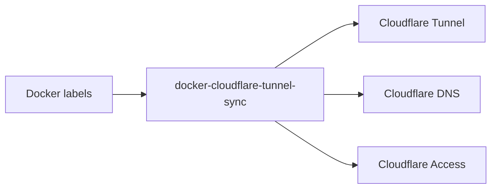

# Docker labels → Cloudflare Tunnel

_No dashboard drift. Containers are the source of truth._

The controller reconciles Docker labels into Cloudflare Tunnel ingress, DNS, and Access resources.

> **Disclaimer:** Use a dedicated Cloudflare Tunnel for this controller. If you attach it to an existing tunnel that already has published application routes, enabling managed sync can delete those routes.

## The problem

Cloudflare Tunnel configuration can drift when container routes are added or removed but dashboard settings are not kept in sync. That mismatch leads to stale ingress rules, outdated Access apps, or DNS records that no longer reflect what is actually running. Over time, manual cleanup becomes a reliability risk.

## The idea

Treat Docker containers as the single source of truth. Opt in explicitly with namespaced labels so only intended services are reconciled, and the controller translates those labels into Cloudflare resources. When containers are removed or no longer labeled, their managed Cloudflare resources should be removed as well.

## How it works



## One example

Minimal labels on a container:

```yaml
labels:
  cloudflare.tunnel.enable: "true"
  cloudflare.tunnel.hostname: "app.example.com"
  cloudflare.tunnel.service: "http://app:8080"
```

Resulting Cloudflare resources:

- An ingress rule for `app.example.com` pointing to `http://app:8080`.
- Optional DNS CNAME and Access app/policy management when the corresponding `SYNC_MANAGED_*` flags are enabled (policies can be referenced by name or ID).

## Design principles

- **Explicit opt-in** via namespaced labels (no implicit discovery).
- **Read-only Docker socket** to avoid mutating the Docker host.
- **Idempotent reconciliation** so repeated runs converge without side effects.
- **Dry-run support** to log intended changes without applying them.
- **Managed-by tagging** to track ownership and safely clean up managed resources.

## Non-goals

- Not a reverse proxy.
- Not a tunnel implementation.
- No implicit discovery of services or labels.

## Who this is for

- Infrastructure engineers managing container fleets.
- Operators who want Cloudflare resources to track labeled services.
- Self-hosted users who prefer explicit, label-driven control.

## Contributing

Issues and pull requests are welcome. Build locally with `docker build -t docker-cloudflare-tunnel-sync:local .`, then run `gofmt` and `go test ./...` with Go 1.24+ before submitting.
